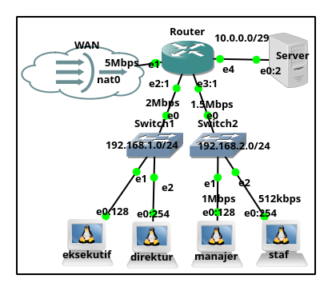

# Konfigurasi External Proxy dengan MikroTik



```sh
/ip firewall address-list 
add address=192.168.0.0/16 list=AreaKantor
add address=192.168.1.0/24 list=PCPimpinan
#add address=192.168.0.0/24 list=AreaWLAN
add address=192.168.2.1-192.168.2.127 list=PCManajer
add address=192.168.2.128-192.168.2.254 list=PCStaf

add list=client address=192.168.1.0/24 disable=no
add list=client address=192.168.2.0/24 disable=no
add list=nogateway address=10.0.0.1-10.0.0.10 disable=no
add list=nogateway address=192.168.1.0/24 disable=no
add list=nogateway address=192.168.2.0/24 disable=no

/ip firewall mangle
add chain=prerouting action=jump jump-target=jump-toproxy protocol=tcp src-address-list=client dst-address-list=!nogateway dst-port=80,443 disable=no
add chain=jump-toproxy action=mark-routing new-routing-mark=route-proxy passthrough=yes disable=no
add chain=jump-toproxy action=mark-packet new-packet-mark=toproxy passthrough=no routing-mark=route-proxy disable=no
add chain=forward action=accept routing-mark=route-proxy disable=no

/ip firewall nat
add chain=srcnat action=accept to-addresses=10.0.0.2 to-ports=3128 protocol=tcp routing-mark=route-proxy disable=no

/ip route
add check-gateway=ping distance=1 gateway=10.0.0.2 routing-mark=route-proxy
```